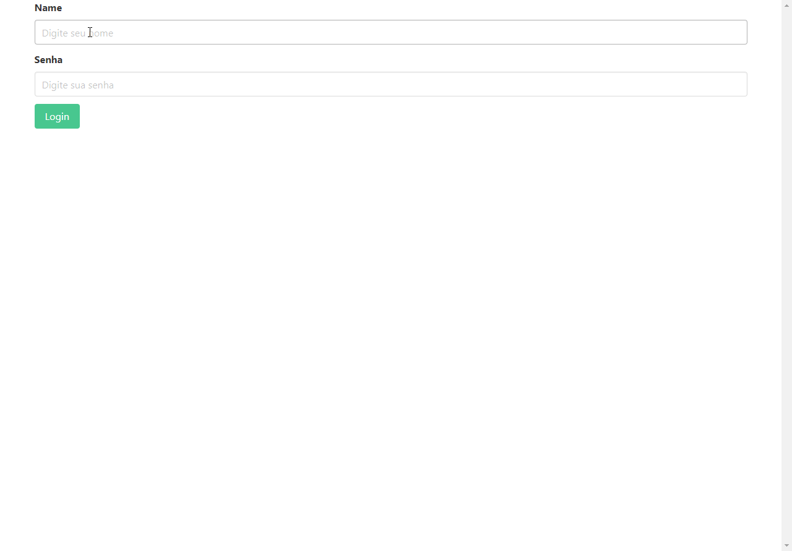

<h1 align="center">Sistema De Login com PHP</h1>

<h1 align="center">
  
</h1>

Sistema De Login com PHP | Apenas para um Usuario

 

 ## 🚀 Tecnologias

Esse projeto foi desenvolvido com as seguintes tecnologias:

- **[PHP](https://www.w3schools.com/php/)**

- **[HTML](https://www.w3schools.com/html/)**

- **[CSS](https://www.w3schools.com/css/)**

#### **Utilitários**

- **Link do Video: [SISTEMA DE LOGIN COM PHP (TUTORIAL)](https://www.youtube.com/watch?v=YaZJZ01MKP4)**
- **Icone Do PHP: [Repositorio devicons/devicon](https://github.com/devicons/devicon/tree/master/icons)**
- **Editor: [Visual Studio Code](https://code.visualstudio.com/)**
- **Markdown: [Markdown Guide](https://www.markdownguide.org/basic-syntax/)**
- **Emoji Markdown: [Emoji Cheat Sheet](https://github.com/ikatyang/emoji-cheat-sheet)**
